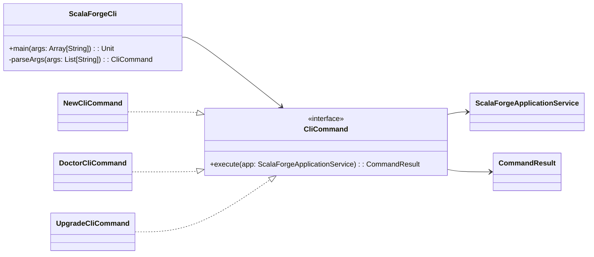
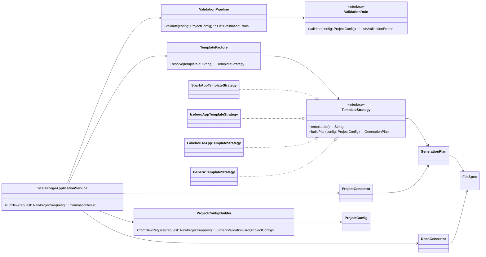
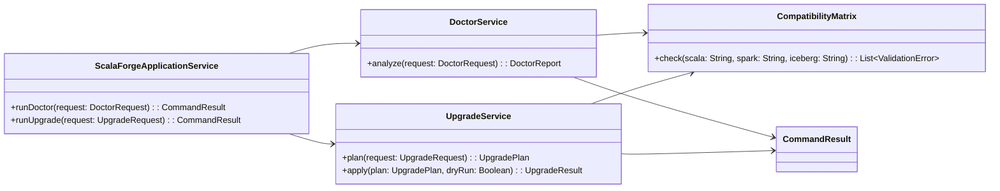

# Scala Forge - Class Diagram

## Design Goals
1. Keep CLI orchestration thin.
2. Isolate generation logic from transport (CLI).
3. Make template behavior pluggable.
4. Support future `doctor` and `upgrade` growth without rewrites.

## Patterns Used
1. `Command`: each CLI operation is a command object (`New`, `Doctor`, `Upgrade`).
2. `Facade`: `ScalaForgeApplicationService` orchestrates all subsystems.
3. `Strategy`: template-specific generation via `TemplateStrategy`.
4. `Abstract Factory`: `TemplateFactory` builds the correct strategy.
5. `Builder`: `ProjectConfigBuilder` assembles validated config.
6. `Chain of Responsibility`: validators run in a chain (`ValidationRule`).

## Mermaid Class Diagram (Split)

### 1) CLI and Command Layer

### 2) Project Generation Pipeline

### 3) Doctor and Upgrade Layer

## Package Structure Recommendation
1. `modules/cli`: parsing, command objects, console output.
2. `modules/core`: domain models, validation contracts, errors.
3. `modules/generator`: generation plan, writers, template orchestration.
4. `modules/templates`: concrete template strategies.
5. `modules/validation`: doctor analyzers and compatibility rules.
6. `modules/docs`: documentation generation (`architecture.md`, runbooks).

## Documentation Considerations
1. Add `docs/architecture.md` with this diagram and one sequence diagram per command.
2. Add ADRs for each major pattern decision (`Command`, `Strategy`, `Factory`, validation pipeline).
3. Document extension points:
   - how to add a new template strategy.
   - how to add a new doctor validation rule.
   - how to add a new upgrade rewrite rule.
4. Keep option compatibility documented in a version matrix (`Scala x Spark x Iceberg`).
5. Add generated-project docs contract:
   - every template must emit `README.md`, `docs/local-development.md`, `docs/deployment.md`, `docs/troubleshooting.md`.

## Next Implementation Step
1. Refactor current `ScalaForgeCli` to `CliCommand` objects that call `ScalaForgeApplicationService` directly.
